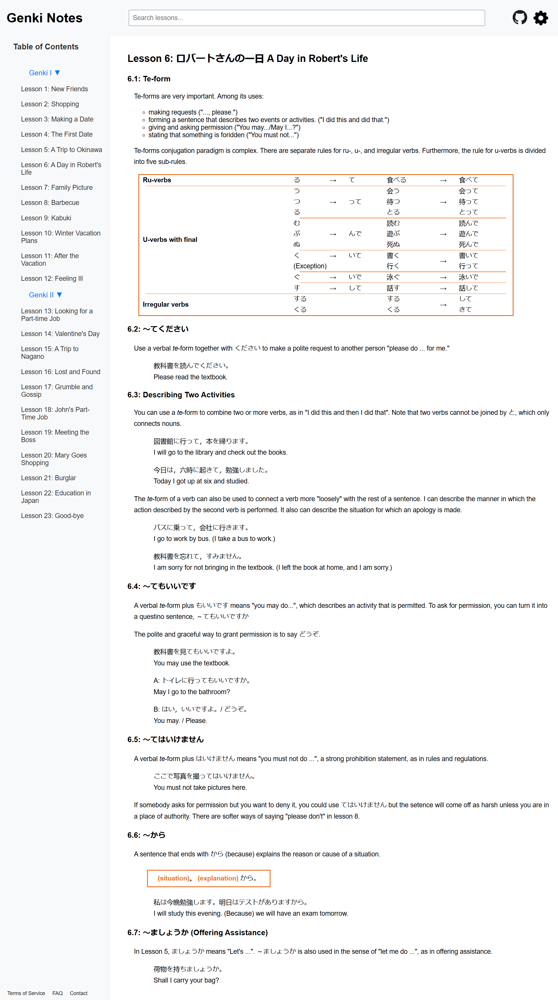

# Genki Review Notes

This page serves as a personal review and summary of what I’ve learned from the Genki I & II textbooks. It’s designed to help me reinforce key concepts and grammar points while providing a quick reference for future study. While this is a personal resource, I hope it can also be useful for others who are revisiting or reviewing the material.

## Table of Contents

- [Setup](#setup)
- [Usage](#usage)
- [Deployment](#deployment)
- [Contributing](#contributing)
- [License](#license)

## Setup

:floppy_disk:

- [React](https://reactjs.org/)
  - Open-source, declarative, component-based JavaScript library for building user interfaces. It’s maintained by Facebook, and it can be used to develop of single-page applications (SPA).

## Usage

:computer:

Designed to be a user-friendly tool for learners, it provides a comprehensive grammar explanations and vocabulary. Key features include Intuitive Navigation, where you can easily navigate through each lessons and sections within each lesson to access the information you need. It also has a powerful search functionality to help you quickly find specific grammar points, vocabulary words, or phrases using the built-in search function. Genki Notes provides customization where you can adjust the font size and switch between light and dark modes to enhance readability to personalize your learning experience.

## Deployment

[Deployed Link](https://paperpatch.github.io/genki_notes/)

## Contributing

:octocat:

[paperpatch](https://github.com/paperpatch)  

## License

:receipt:
